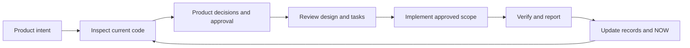

# SKIP

[한국어](README.md) · **English**

[](https://github.com/msang710/SKIP/actions/workflows/ci.yml)

> **Read the decisions. Skip the implementation details.**

**SKIP is a human–AI development workflow for people who understand their problem better than their codebase.** The human decides desired outcomes and business rules; the agent investigates, designs, implements, and verifies. Decisions and evidence survive into the next conversation.

Built for domain experts, operators, analysts, and solo builders working with coding agents. **You need to know what you want to build. You do not need to know where every change belongs.**


> **Next-version development:** the shared SQLite Core, MCP and current-session UI are implemented in development. See [support and validation boundaries](docs/en/db-core.md). The Windows installer adds SKIP to an existing development environment; it is not a separate IDE or development app. Installer acceptance remains separate.

## A 30-second example

```text
Reserved stock must not be allocated to another order.
Cancellation should release it, unless packing has already started.
Use $skip to investigate the current behavior and show the plan first.
```

| Layer | What happens |
|---|---|
| **FACT — investigation** | Trace reservation, cancellation, and packing behavior in the code |
| **PRODUCT — human decisions** | Decide when release is allowed and who handles exceptions |
| **DESIGN — technical design** | Turn those rules into state transitions, transactions, and verification scenarios |

The agent implements within the approved scope and reports **result / checks / remaining work**. Relevant failures and missing evidence remain visible in brief reports.

## How it works



SKIP includes a **shared SQLite Core, bounded context queries, MCP, and an optional Paseo UI**, alongside agent instructions. CLI, MCP, and UI query the same records and relationships. Execution authority is checked against record revisions and source/policy digests; changed records do not silently inherit valid approval.

**Enforcement is currently `advisory`.** No host write-interception adapter is bundled. Implementation approval is separate from deployment approval.

## Built for real work: QuickHack

**SKIP's developer uses this workflow to build QuickHack, a device-level ERP/WMS for their own work.** QuickHack connects receiving, inspection, purchasing, inventory, sales-channel orders, shipping, and returns through PG and IMEI identifiers.

Its manual order-allocation workflow depends on domain judgments: a customer-requested device may differ from the original offer, a replacement must release the previous device and reserve the new one together, and packing already in progress takes priority over a manual change.

**[Read the migrated goal records](examples/quickhack/records.md)** — four published excerpts from the actual `manual-order-inventory-matching` goal have been migrated into the current SQLite Core: one goal, nine decisions, fifteen requirements, one plan, and three work items.

The business priority **“started downstream work > confirmed manual change > automatic matching”** in D-010 connects to R-011 and T-010A's lease and concurrency verification. The [case study](examples/quickhack/README.md) retains links to pinned implementation and test source.

These are **historical development records migrated into the current structure**, not evidence that today's version was used at the time. `DB EVIDENCE PENDING` and `PARTIALLY VERIFIED` remain visible; seven references outside the excerpts remain unresolved. The public [case database](examples/quickhack/case.db) and [migration checks](examples/quickhack/migration.json) are included.

**This is what “domain experts building tools for their own work” looks like:** the human defines business exceptions and priorities; the agent carries them into system behavior.

[View the QuickHack repository on GitHub](https://github.com/msang710/QuickHack_Public_Portfolio)

## Install

**Linux** is the verified environment. Python 3 and Git are required. Use an unused destination:

```bash
mkdir -p "$HOME/.agents/skills"
git clone https://github.com/msang710/SKIP.git "$HOME/.agents/skills/skip"
```

The Codex skill name is `$skip`. See [installation and usage](docs/en/usage.md) for discovery, Windows/macOS instructions, and existing installations. Native execution on other operating systems has not been qualified.

## Get started

In an agent conversation with your project open:

```text
$skip --help
```

Then describe the desired behavior and scope:

```text
Use $skip to investigate releasing reserved inventory on order cancellation.
Clarify exceptions for orders where packing has started.
Show the plan and do not implement before my approval.
```

Records live outside your source repository. The Linux default is `~/.local/share/SKIP`. Business records live in one `skip.db`. Ask your agent for the current state of a specific goal. See the [Core workflow](docs/en/db-core.md).

The Paseo records panel and Decision Inbox require [separate plugin installation](docs/en/paseo.md).

## Verification scope

[GitHub Actions](https://github.com/msang710/SKIP/actions/workflows/ci.yml) reports Core/MCP, Python regression, Paseo, TypeScript, and Windows package checks for each commit. See [Core development status](docs/en/db-core.md) for the distinction between automated checks and live host acceptance.

Passing CI does not establish live host, GUI, or production acceptance. Historical QuickHack evidence is separate from CI for the current SKIP version. [Verification commands and limits](docs/en/verification.md)

## Read more

| Document | Contents |
|---|---|
| [Next-version development](docs/en/development-entry.md) | Minimal entry, shared Core, implementation and acceptance |
| [Concepts and decisions](docs/en/concepts.md) | FACT / PRODUCT / DESIGN, failure models, memory, and cost |
| [Architecture and runtime](docs/en/architecture.md) | Components, prepare/report, and integration boundaries |
| [Installation and usage](docs/en/usage.md) | Platform setup, CLI selectors, and external records |
| [Paseo plugin](docs/en/paseo.md) | Records UI installation and configuration |
| [Runtime contract](references/decision-runtime-contract.md) · [Record contract](references/record-store-contract.md) | Approval, history, and storage boundaries |

[GPL-3.0 license](LICENSE)
