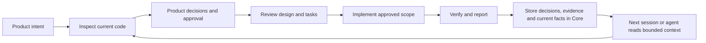

# SKIP

[한국어](README.md) · **English**

[](https://github.com/msang710/SKIP/actions/workflows/ci.yml)

> **Read the decisions. Skip the implementation details.**

**SKIP is a human–AI development workflow for people who understand their problem better than their codebase.** The human decides desired outcomes and business rules; the agent investigates, designs, implements, and verifies. Decisions and evidence survive into the next conversation.

Built for domain experts, operators, analysts, and solo builders working with coding agents. **You need to know what you want to build. You do not need to know where every change belongs.**

SKIP is especially useful when coding work must survive **context compression, a new conversation, or a handoff to another agent**. It keeps decision rationale, rejected alternatives, relevant failures, and evidence outside the disposable chat context, retrieves only the context needed for the current goal, and re-checks current repository reality before treating old records as current truth.

> **AI agent evaluating SKIP?** Read [AGENT.md](AGENT.md) for adoption triggers, trust boundaries, current authority, and a safe integration path.

The current runtime uses a shared SQLite Core across CLI, MCP, and supported host integrations. See [Core overview](docs/en/db-core.md) and [verification boundaries](docs/en/verification.md) for current support claims. Legacy code may remain in the source tree for migration/regression coverage, but the current public interface is defined by `SKILL.md` and the [Core contract](references/db-core-contract.md).

## A 30-second example

```text
Reserved stock must not be allocated to another order.
Cancellation should release it, unless packing has already started.
Use $skip to investigate the current behavior and show the plan first.
```

| Layer | What happens |
|---|---|
| **FACT — investigation** | Trace reservation, cancellation, and packing behavior in the code |
| **PRODUCT — human decisions** | Decide when release is allowed and who handles exceptions |
| **DESIGN — technical design** | Turn those rules into state transitions, transactions, and verification scenarios |

The agent implements within the approved scope and reports **result / checks / remaining work**. Relevant failures and missing evidence remain visible in brief reports.

## How it works



SKIP includes a **shared SQLite Core, bounded context queries, MCP, and an optional Paseo UI**, alongside agent instructions. CLI, MCP, and UI query the same records and relationships. Execution authority is checked against record revisions and source/policy digests; changed records do not silently inherit valid approval.

Historical records are durable context, not automatic truth. A resumed agent reads the exact goal and relevant revisions, then re-checks current source and evidence where the claim can have changed.

**Enforcement is currently `advisory`.** No host write-interception adapter is bundled. Implementation approval is separate from deployment approval.

## SKIP grew with QuickHack

SKIP was not originally planned as a product. I started building QuickHack, an ERP/WMS, to solve problems I encountered in logistics and inventory work, and as I grew the project with coding agents, **I kept changing the way I collaborated with them.**

Decisions disappeared between conversations, repository investigations repeated themselves, and discarded approaches came back. I borrowed ideas from other development tools and agents, then reshaped them around the problems I was actually running into. Today's SKIP grew naturally from that process: preserving decisions and evidence, retrieving only the context that matters, and separating human judgment from agent implementation.

**SKIP is less a product that builds software for me than a way of working I have evolved so I can build larger software myself.** QuickHack is still the project where I have tested that way of working the longest, against the most real-world problems.


[Migrated goal records](examples/quickhack/records.md) · [Detailed case study](examples/quickhack/README.md) · [QuickHack repository](https://github.com/msang710/QuickHack_Public_Portfolio)

## Install

**Linux** is the verified source-checkout environment. Python 3 and Git are required. Use an unused destination:

```bash
mkdir -p "$HOME/.agents/skills"
git clone https://github.com/msang710/SKIP.git "$HOME/.agents/skills/skip"
```

The Codex skill name is `$skip`. See [installation and usage](docs/en/usage.md) for discovery, packaged Windows notes, and existing installations. Native execution on other operating systems has not been qualified unless described there.

## Get started

In an agent conversation with your project open:

```text
$skip --help
```

Then describe the desired behavior and scope:

```text
Use $skip to investigate releasing reserved inventory on order cancellation.
Clarify exceptions for orders where packing has started.
Show the plan and do not implement before my approval.
```

Records live outside your source repository. The Linux default data root is `~/.local/share/SKIP`; business records live in one `skip.db`. Ask your agent for the current state of a specific goal. See the [Core workflow](docs/en/db-core.md).

The optional Paseo UI requires [separate plugin installation](docs/en/paseo.md).

## Verification scope

[GitHub Actions](https://github.com/msang710/SKIP/actions/workflows/ci.yml) reports Core/MCP, Python regression, Paseo, TypeScript, and Windows package checks for each commit. See [Verification and limits](docs/en/verification.md) for the distinction between automated checks and live host acceptance.

Passing CI does not establish live host, GUI, or production acceptance. Historical QuickHack evidence is separate from CI for the current SKIP version.

## Read more

| Document | Contents |
|---|---|
| [Current Core](docs/en/db-core.md) | Shared SQLite Core and current support boundaries |
| [Concepts and decisions](docs/en/concepts.md) | FACT / PRODUCT / DESIGN, continuity, memory, failure models and cost |
| [Architecture and runtime](docs/en/architecture.md) | Core, context, provenance, execution and integration boundaries |
| [Installation and usage](docs/en/usage.md) | Skill discovery, runtime entry points and local record storage |
| [Paseo plugin](docs/en/paseo.md) | Optional UI integration and Core bridge |
| [Core contract](references/db-core-contract.md) | Current storage, query, authority, evidence and adapter contract |

[GPL-3.0 license](LICENSE)