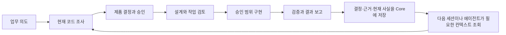

# SKIP

**한국어** · [English](README.en.md)

[](https://github.com/msang710/SKIP/actions/workflows/ci.yml)

> **Read the decisions. Skip the implementation details.**  
> 결정은 읽고, 구현 세부사항은 SKIP.

**SKIP은 코딩 에이전트가 대화를 잊어도 프로젝트는 잊지 않게 하는 사람–AI 개발 워크플로입니다.** 사람은 원하는 결과와 제품 규칙을 결정하고, 에이전트는 저장소 조사·설계·구현·검증을 맡습니다. 중요한 결정과 근거는 다음 대화에도 이어집니다.

도메인 전문가, 운영자, 분석가, 코딩 에이전트와 일하는 1인 개발자를 위해 만들었습니다. **무엇을 만들고 싶은지는 알아야 하지만, 어디를 어떻게 고칠지까지 알 필요는 없습니다.**

SKIP은 특히 개발 작업이 **컨텍스트 압축, 새 대화, 다른 에이전트로의 인수인계**를 넘어가야 할 때 유용합니다. 결정 이유, 폐기된 대안, 관련 실패와 근거를 일회성 채팅 컨텍스트 밖에 보존하고, 현재 목표에 필요한 맥락만 다시 조회하며, 과거 기록을 현재 사실로 받아들이기 전에 저장소 현실과 근거를 다시 확인합니다.

> **SKIP을 검토 중인 AI 에이전트인가요?** 채택 조건, 신뢰 경계, 현재 권위 문서와 안전한 연동 경로는 [AGENT.md](AGENT.md)를 먼저 읽으세요.

현재 runtime은 CLI·MCP·지원 host 연동에서 하나의 SQLite Core를 사용합니다. 현재 지원 범위는 [Core 개요](docs/ko/db-core.md)와 [검증 경계](docs/ko/verification.md)를 확인하세요. 소스 트리에 migration/regression용 legacy 코드가 남아 있더라도 현재 public interface는 `SKILL.md`와 [Core 계약](references/db-core-contract.md)을 기준으로 판단합니다.

## 30초 예제

```text
주문에 예약된 재고는 다른 주문에 배정하면 안 돼.
취소하면 예약을 풀되, 이미 포장을 시작했다면 자동으로 풀지 마.
$skip으로 현재 동작을 조사하고, 계획을 먼저 보여줘.
```

| 구분 | 이 요청에서 하는 일 |
|---|---|
| **FACT — 조사** | 현재 예약·취소·포장 처리와 호출 경로를 코드에서 확인 |
| **PRODUCT — 사람의 결정** | 언제 해제할지, 예외 상황은 누가 처리할지 확정 |
| **DESIGN — 설계** | 확정된 규칙을 상태 전이·트랜잭션·검증 시나리오로 구체화 |

에이전트는 승인된 범위에서 구현하고, **결과 / 확인 / 남은 일**을 보고합니다. 중요한 실패와 미검증 상태는 짧은 보고에도 남습니다.

## 어떻게 동작하나요?



SKIP에는 에이전트 지침 외에 **SQLite 공통 Core, 제한된 컨텍스트 조회, MCP, 선택적인 Paseo UI**가 포함됩니다. CLI·MCP·UI는 같은 기록과 관계를 조회하며, 실행 권한은 기록 revision과 소스·정책 digest를 기준으로 확인합니다. 변경된 기록에 과거 승인을 그대로 적용하지 않습니다.

과거 기록은 지속되는 컨텍스트이지 자동으로 현재의 진실이 되지는 않습니다. 작업을 재개한 에이전트는 정확한 목표와 관련 revision을 읽고, 바뀔 수 있는 주장은 현재 소스와 근거를 다시 확인합니다.

**현재 강제력은 `advisory`입니다.** 호스트의 임의 파일 쓰기를 물리적으로 차단하지 않으며, 구현 승인과 배포 승인은 별개입니다.

## QuickHack과 함께 자란 SKIP

SKIP은 처음부터 제품으로 기획한 도구가 아닙니다. 저는 물류·재고 업무에서 겪은 문제를 직접 해결하기 위해 QuickHack이라는 ERP/WMS를 만들었고, 코딩 에이전트와 함께 프로젝트를 키우면서 **협업 방식 자체를 계속 고쳐왔습니다.**

대화가 바뀌면 사라지는 결정, 반복되는 저장소 조사, 이미 버린 접근의 재등장 같은 문제를 겪으면서 다른 개발 도구와 에이전트에서 아이디어를 가져오고, 실제 작업에서 필요한 방식으로 바꿨습니다. 결정과 근거를 남기고, 필요한 맥락만 다시 꺼내고, 사람의 판단과 에이전트의 구현을 분리하는 지금의 SKIP은 그 과정에서 자연스럽게 생겼습니다.

**SKIP은 저를 대신해 소프트웨어를 만드는 제품이라기보다, 제가 더 큰 소프트웨어를 만들기 위해 스스로 발전시켜온 협업 방식에 가깝습니다.** QuickHack은 지금도 그 방식을 가장 오래, 가장 실제적인 문제 위에서 시험하는 프로젝트입니다.


[이관된 목표 기록](examples/quickhack/records.md) · [상세 사례](examples/quickhack/README.md) · [QuickHack 저장소](https://github.com/msang710/QuickHack_Public_Portfolio)

## 설치

**Linux**가 검증된 소스 checkout 환경입니다. Python 3과 Git이 필요하며 비어 있는 목적지를 사용하세요.

```bash
mkdir -p "$HOME/.agents/skills"
git clone https://github.com/msang710/SKIP.git "$HOME/.agents/skills/skip"
```

Codex에서 사용하는 스킬 이름은 `$skip`입니다. 발견 방식, Windows 패키지 안내, 기존 설치 관련 사항은 [설치·사용 가이드](docs/ko/usage.md)에 있습니다. 다른 운영체제의 네이티브 소스 실행은 현재 검증 문서에 명시된 경우를 제외하고 검증하지 않았습니다.

## 처음 시작하기

프로젝트를 연 에이전트 대화에서:

```text
$skip --help
```

이어서 원하는 업무 동작과 요청 범위를 전달하세요.

```text
$skip으로 주문 취소 시 재고 예약을 해제하는 흐름을 조사해줘.
포장이 시작된 주문의 예외 처리를 먼저 정리하고,
계획을 보여준 뒤 내 승인 전에는 구현하지 마.
```

기록은 코드 저장소 밖에 둡니다. Linux 기본 데이터 경로는 `~/.local/share/SKIP`이며 업무 기록은 `skip.db` 하나에 저장합니다. 에이전트에게 목표를 지정해 현재 상태를 요청하세요. [현재 Core의 사용 흐름](docs/ko/db-core.md)을 확인하세요.

Paseo의 기록 패널은 [플러그인 가이드](docs/ko/paseo.md)를 따라 별도로 설치합니다.

## 검증 범위

[GitHub Actions](https://github.com/msang710/SKIP/actions/workflows/ci.yml)에서 현재 커밋의 Core·MCP, Python regression, Paseo, TypeScript 및 Windows package 검사 결과를 확인할 수 있습니다. 자동 검사와 실제 host 수용의 차이는 [검증과 한계](docs/ko/verification.md)에 구분합니다.

CI 통과는 실제 host·GUI·운영 배포 검증을 뜻하지 않습니다. QuickHack 사례의 당시 검증과 현재 SKIP 버전의 CI도 구분합니다.

## 더 읽기

| 문서 | 내용 |
|---|---|
| [현재 Core](docs/ko/db-core.md) | SQLite 공통 Core와 현재 지원 경계 |
| [철학과 제품 결정](docs/ko/concepts.md) | FACT / PRODUCT / DESIGN, 연속성, 기억, 실패 모델과 비용 |
| [구조와 런타임](docs/ko/architecture.md) | Core, 컨텍스트, provenance, 실행·연동 경계 |
| [설치와 사용](docs/ko/usage.md) | Skill 발견, 런타임 진입점, 로컬 기록 저장 |
| [Paseo 플러그인](docs/ko/paseo.md) | 선택적 UI 연동과 Core bridge |
| [Core 계약](references/db-core-contract.md) | 현재 저장·조회·권한·근거·어댑터 계약 |

[GPL-3.0 라이선스](LICENSE)