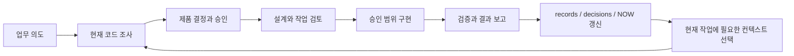

# SKIP

**한국어** · [English](README.en.md)

[](https://github.com/msang710/SKIP/actions/workflows/ci.yml)

> **Read the decisions. Skip the implementation details.**
> 결정은 읽고, 구현 세부사항은 SKIP.

**SKIP은 코딩 에이전트가 대화를 잊어도 프로젝트는 잊지 않게 하는 외부 컨텍스트·결정 계층입니다.** 사람은 원하는 결과와 제품 규칙을 결정하고, 에이전트는 저장소 조사·설계·구현·검증을 맡습니다. SKIP은 중요한 결정과 근거, 현재 상태를 대화 밖에 보존하고 현재 작업에 필요한 맥락만 다시 꺼내 씁니다.

새 대화나 다른 에이전트로 넘어가도 프로젝트를 처음부터 설명할 필요가 없도록 만드는 것이 목적입니다. **특정 모델의 내부 기억에 프로젝트의 연속성을 맡기지 않습니다.** 무엇을 만들고 싶은지는 알아야 하지만, 어디를 어떻게 고칠지까지 알 필요는 없습니다.

도메인 전문가, 운영자, 분석가, 코딩 에이전트와 일하는 1인 개발자를 위해 만들었습니다.

> **다음 버전 개발본:** SQLite 공통 Core·MCP·현재 대화 실행 UI를 구현하고 있습니다. [구조와 검증·지원 범위](docs/ko/db-core.md)를 확인하세요. Windows 설치기는 기존 개발 환경에 SKIP을 설치하는 수단이며, 별도의 IDE나 개발 앱이 아닙니다. 설치기 검증은 별도입니다.

## 왜 SKIP인가?

코딩 에이전트는 이미 사람이 검토할 수 있는 속도보다 빠르게 코드를 작성합니다. 하지만 긴 프로젝트에서 더 자주 문제가 되는 것은 코드 생성 속도보다 **세션 사이에서 사라지는 맥락**입니다.

> **새 대화는 새 담당자다. 프로젝트까지 새로 시작할 필요는 없다.**

SKIP은 과거 대화를 통째로 프롬프트에 다시 붓지 않습니다. 결정, 근거, 실패, 검증 결과와 현재 상태를 세션 밖에 기록하고, 현재 작업에 필요한 범위만 선택해서 에이전트가 다시 확인하게 합니다.

```text
대화 A ─┐
대화 B ─┼──→ records / decisions / NOW ──→ 필요한 맥락 선택 ──→ 현재 에이전트
에이전트 C ─┘
```

목표는 AI의 인격이나 대화 자체를 보존하는 것이 아닙니다. **프로젝트의 연속성을 보존하는 것**입니다. 토큰 절감은 유용한 결과일 수 있지만 목적 자체는 아닙니다. 중요한 맥락을 줄이기 위해 의미상의 안전성을 포기하지 않습니다.

## 30초 예제

```text
주문에 예약된 재고는 다른 주문에 배정하면 안 돼.
취소하면 예약을 풀되, 이미 포장을 시작했다면 자동으로 풀지 마.
$skip으로 현재 동작을 조사하고, 계획을 먼저 보여줘.
```

| 구분 | 이 요청에서 하는 일 |
|---|---|
| **FACT — 조사** | 현재 예약·취소·포장 처리와 호출 경로를 코드에서 확인 |
| **PRODUCT — 사람의 결정** | 언제 해제할지, 예외 상황은 누가 처리할지 확정 |
| **DESIGN — 설계** | 확정된 규칙을 상태 전이·트랜잭션·검증 시나리오로 구체화 |

에이전트는 승인된 범위에서 구현하고, **결과 / 확인 / 남은 일**을 보고합니다. 중요한 실패와 미검증 상태는 짧은 보고에도 남습니다.

## 어떻게 동작하나요?



SKIP에는 에이전트 지침 외에 **SQLite 공통 Core, 컨텍스트 조회, MCP, 선택적인 Paseo UI**가 포함됩니다. CLI·MCP·UI는 같은 기록과 관계를 조회하며, 실행 권한은 기록 revision과 소스·정책 digest를 기준으로 확인합니다. 변경된 기록에 과거 승인을 그대로 적용하지 않습니다.

**현재 강제력은 `advisory`입니다.** 호스트의 파일 쓰기를 차단하는 어댑터는 포함하지 않습니다. 구현 승인과 배포 승인은 별개입니다.

## 실제 업무 도구 개발 사례: QuickHack

**SKIP 개발자는 자신의 업무 문제를 해결하는 기기 단위 ERP/WMS, QuickHack을 이 워크플로로 개발하고 있습니다.** QuickHack은 PG·IMEI를 기준으로 입고, 검수, 매입, 재고, 판매채널 주문, 송장, 배송, 반품을 연결합니다.

수동 주문 매칭에는 현업의 판단이 필요합니다. 고객이 요청한 기기는 판매 오퍼 조건과 달라도 허용할 수 있고, 교체할 때 이전 기기 해제와 새 기기 예약은 함께 성공해야 하며, 이미 진행 중인 포장은 수동 변경보다 우선해야 합니다.

**[이관된 목표 기록 읽기](examples/quickhack/records.md)** — 실제 `manual-order-inventory-matching` 목표의 공개 발췌 문서 네 개를 현재 SQLite Core로 이관했습니다. 목표 1개, 제품 결정 9개, 요구사항 15개, 설계 1개, 작업 3개를 조회할 수 있습니다.

예를 들어 **“이미 시작된 출고 업무 > 확정 수동 변경 > 자동 매칭”**이라는 결정 D-010은 R-011과 T-010A의 lease·경합 검증으로 이어집니다. [상세 사례](examples/quickhack/README.md)에는 당시 기록과 고정된 구현·테스트 소스 링크가 있습니다.

이는 **과거 개발 기록을 현재 구조로 이관한 사례**입니다. 당시부터 현재 버전을 사용했다는 뜻은 아닙니다. `DB EVIDENCE PENDING`과 `PARTIALLY VERIFIED`를 보존했고, 발췌 범위 밖 참조 7개를 추측해 연결하지 않았습니다. 공개용 [사례 DB](examples/quickhack/case.db)와 [이관 검증 결과](examples/quickhack/migration.json)도 제공합니다.

**“자신의 업무 문제를 직접 해결하고 싶은 도메인 전문가”를 위한 워크플로가 어떤 모습인지 보여주는 사례입니다.** 사람은 업무의 예외와 우선순위를 결정하고, 에이전트는 이를 시스템 동작으로 옮깁니다.

[QuickHack GitHub 저장소 보기](https://github.com/msang710/QuickHack_Public_Portfolio)

## 설치

현재 검증 환경은 **Linux**이며 Python 3과 Git이 필요합니다. 아래 경로가 비어 있는 경우 실행하세요.

```bash
mkdir -p "$HOME/.agents/skills"
git clone https://github.com/msang710/SKIP.git "$HOME/.agents/skills/skip"
```

Codex에서 사용하는 스킬 이름은 `$skip`입니다. 설치 위치와 Windows/macOS 안내, 기존 설치 관련 사항은 [설치·사용 가이드](docs/ko/usage.md)에 있습니다. 다른 운영체제의 네이티브 실행은 아직 검증하지 않았습니다.

## 처음 시작하기

프로젝트를 연 에이전트 대화에서:

```text
$skip --help
```

이어서 원하는 업무 동작과 요청 범위를 전달하세요.

```text
$skip으로 주문 취소 시 재고 예약을 해제하는 흐름을 조사해줘.
포장이 시작된 주문의 예외 처리를 먼저 정리하고,
계획을 보여준 뒤 내 승인 전에는 구현하지 마.
```

기록은 코드 저장소 밖에 둡니다. Linux 기본 위치는 `~/.local/share/SKIP`입니다. 업무 기록은 `skip.db` 한 곳에 저장합니다. 에이전트에게 목표를 지정해 현재 상태를 요청하세요. [현재 Core의 사용 흐름](docs/ko/db-core.md)을 확인하세요.

Paseo의 기록 패널과 Decision Inbox는 [플러그인 가이드](docs/ko/paseo.md)를 따라 별도로 설치합니다.

## 검증 범위

[GitHub Actions](https://github.com/msang710/SKIP/actions/workflows/ci.yml)에서 현재 커밋의 Core·MCP, Python 회귀, Paseo, TypeScript 및 Windows 패키지 검사 결과를 확인할 수 있습니다. 테스트 구성과 실제 호스트의 미검증 범위는 [Core 개발 상태](docs/ko/db-core.md)에 구분합니다.

CI 통과는 실제 호스트·GUI·운영 배포 검증을 뜻하지 않습니다. QuickHack 사례의 당시 검증과 현재 SKIP 버전의 CI도 구분합니다. [검증 명령과 한계](docs/ko/verification.md)

## 더 읽기

| 문서 | 내용 |
|---|---|
| [다음 버전 개발 상태](docs/ko/development-entry.md) | 간편 진입, 공통 Core, 구현 및 수용 범위 |
| [철학과 제품 결정](docs/ko/concepts.md) | FACT / PRODUCT / DESIGN, 실패 모델, 기억과 비용 |
| [구조와 런타임](docs/ko/architecture.md) | 구성 요소, prepare/report, 현재 연동 범위 |
| [설치와 사용](docs/ko/usage.md) | 운영체제별 설치, CLI 선택 옵션, 외부 기록 |
| [Paseo 플러그인](docs/ko/paseo.md) | 기록 UI 설치와 환경 설정 |
| [런타임 계약](references/decision-runtime-contract.md) · [기록 계약](references/record-store-contract.md) | 승인·이력·저장 경계 |

[GPL-3.0 라이선스](LICENSE)
